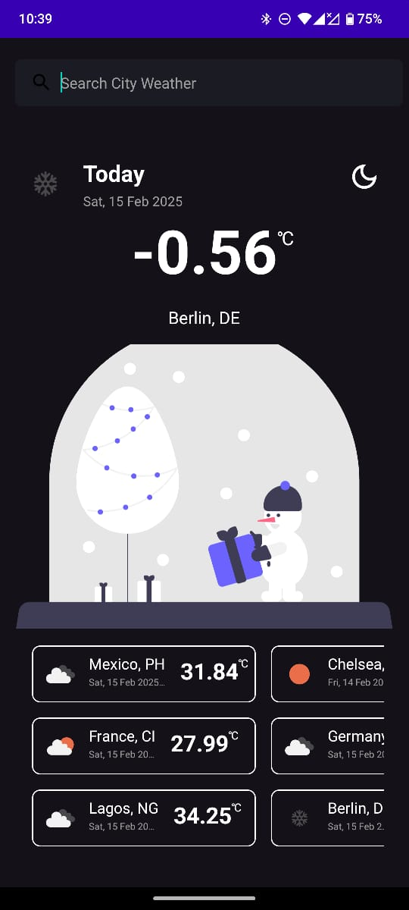
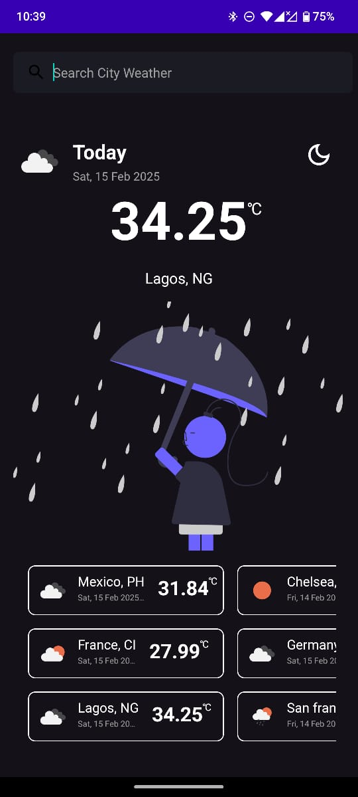
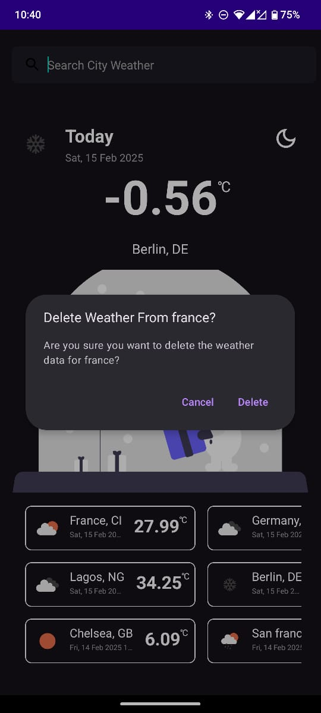
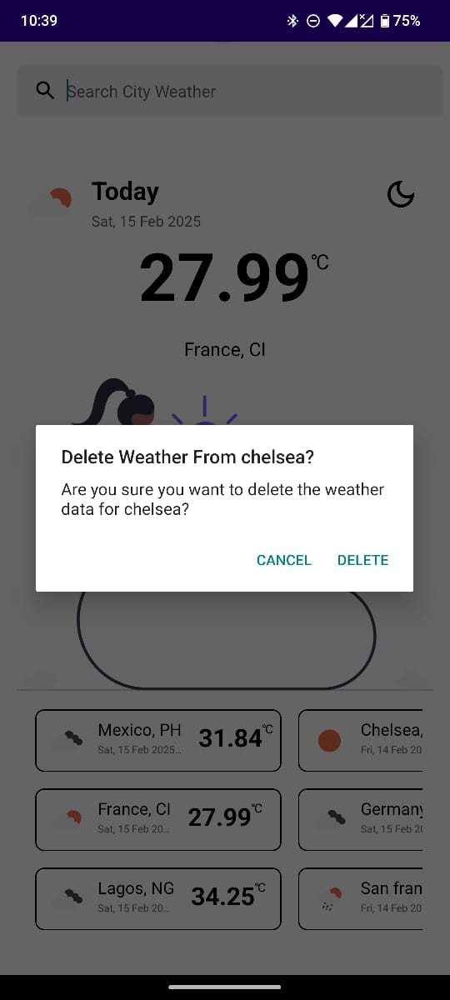
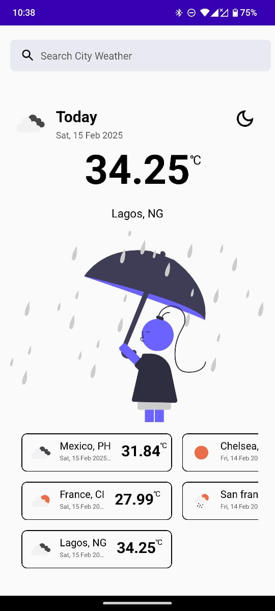
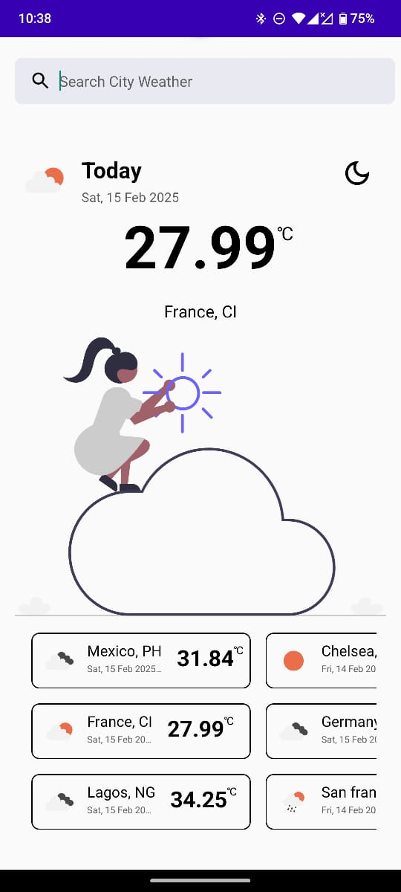

# News App 🗞
[]

News App is a simple news app 🗞️ which uses [NewsAPI](https://newsapi.org/) to fetch top news headlines from the API and also search for mews based on user query. The main aim of this app is to be a leading example for best pratices in morden android development architecture and also for a sample project

The codebase focuses 👓 on following key things:
1. [ViewBinding](https://developer.android.com/topic/libraries/view-binding)
2. [Navigation Components](https://developer.android.com/guide/navigation/navigation-getting-started) using Fragments
3. [LiveData](https://developer.android.com/reference/android/arch/lifecycle/LiveData) & [ViewModel](https://developer.android.com/reference/android/arch/lifecycle/ViewModel)
4. [Dagger2](https://developer.android.com/training/dependency-injection/dagger-basics) + [Hilt](https://developer.android.com/training/dependency-injection/hilt-android) - dependency injection
5. [Retrofit](https://square.github.io/retrofit/)
6. [Room](https://developer.android.com/training/data-storage/room)
7. [Paging3](https://developer.android.com/topic/libraries/architecture/paging/v3-overview), [PagingDataAdapter](https://developer.android.com/reference/kotlin/androidx/paging/PagingDataAdapter), [LoadStateAdapter](https://developer.android.com/reference/kotlin/androidx/paging/LoadStateAdapter)
18. [RecyclerView](https://developer.android.com/guide/topics/ui/layout/recyclerview), [ListAdapter](https://developer.android.com/reference/androidx/recyclerview/widget/ListAdapter)
18. [GSON](https://github.com/google/gson)
10. [Kotlin Flow](https://developer.android.com/kotlin/flow)
11. [Material Design](https://material.io/develop/android)
12. [Kotlin Coroutines](https://developer.android.com/kotlin/coroutines)
13. Clean code with Tests
14. Firebase Crashlytics 

The idea is to keep the app super simple while demonstrating new libraries and tools which makes it easier to build high quality Android applications.

# Development Setup 🖥

You will require latest version of Android Studio 3.0 (or newer) to be able to build the app

## API key 🔑
You'll need to provide API key to fetch the news from the News Service (API). Currently the news is fetched from [NewsAPI](https://newsapi.org/) 

- Generate an API key (It's only 2 steps!) from [NewsAPI](https://newsapi.org/)
- Add the apiKey as a value in your `local.properties`
```
    API_KEY = <INSERT_YOUR_API_KEY>
```
- Build the app 
- Good Luck 🎉

<h2 align="left">ScreenShots</h2>
<h4 align="start">






<br>

## Architecture

The app uses MVVM [Model-View-ViewModel] architecture to have a unidirectional flow of data, separation of concern, testability, and a lot more.

Read more: 
- [Building Modern Android Apps with Architecture Guidelines](https://medium.com/@aky/building-modern-apps-using-the-android-architecture-guidelines-3238fff96f14)
- [Guide to app architecture](https://developer.android.com/jetpack/docs/guide)


## TODO

Important 

1) Pager Integration in Api response (Added)
2) BackPress in SearchView (Added)
3) Loading Animation

## Author
Emmanuel Iyke

## License
This project is licensed under the Apache License 2.0 - See: http://www.apache.org/licenses/LICENSE-2.0.txt
